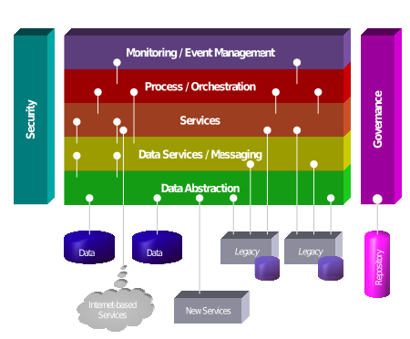

# SOA理论与概念

## 描述

SOA（Service-Oriented Architecture），面向服务的架构，它是通过应用组件的方式向其他组件提供服务的一种软件设计的风格，提供服务的方式是基于网络的通信协议。SOA 的基本原则是独立于供应商、产品和技术。服务是一个独立的功能单元，可以远程访问并独立操作和更新，例如在线检索信用卡声明。

根据 SOA 的许多定义之一，服务具有四个属性：

1. 它逻辑上代表具有指定结果的业务活动。
2. 它是独立的。
3. 它是消费者的黑盒子。
4. 它可能包含其他基础服务

1998年，SOA 首先被称为基于服务的体系结构，由一个团队开发集成的基础管理服务，然后是基于工作单元的业务流程类型服务，并使用 CORBA 进行进程间通信。

可以结合使用不同的服务来提供大型软件应用程序的功能，SOA 与模块化编程共享的原则。面向服务的体系结构集成了分布式，单独维护和部署的软件组件。它通过技术和标准实现，这些技术和标准有助于组件通过网络进行通信和协作，尤其是通过 IP 网络。

## 概述

在 SOA 中，服务使用描述如何使用描述元数据传递和解析消息的协议。该元数据描述了服务的功能特征和服务质量特征。面向服务的体系结构旨在允许用户将大块功能组合在一起，形成纯粹由现有服务构建并以临时方式组合的应用程序。服务为请求者提供了一个简单的接口，它抽象出作为黑盒子的底层复杂性。其他用户也可以在不了解其内部实现的情况下访问这些独立服务。

## 定义概念

相关的流行语面向服务促进了服务之间的松散耦合。SOA 将功能分为不同的单元或服务，开发人员可以通过网络访问这些单元或服务，以便允许用户在应用程序的生产中组合和重用它们。这些服务及其相应的消费者通过以明确定义的共享格式传递数据或通过协调两个或更多服务之间的活动来相互通信。

2009 年 10 月发布了一份面向服务架构的宣言。其中提出了六个核心价值观，如下所示：

1. 商业价值比技术战略更重要。
2. 战略目标比项目特定的利益更重要。
3. 本质互操作性比定制集成更重要。
4. 共享服务比特定用途实现更重要。
5. 灵活性比优化更重要。
6. 演进式的精化比追求初始完美更重要。

SOA 可以被视为连续体的一部分，其范围从分布式计算和模块化编程的旧概念到 SOA，再到当前的 mashup ，SaaS 和云计算实践（有些人认为是 SOA 的后代）。

## 原则

尽管许多行业来源已经发布了自己的原则，但业界没有与面向服务架构的确切的相关行业标准。包括以下内容：

- 标准化服务合同
  服务遵循标准通信协议，由一组给定服务中的一个或多个服务描述文档共同定义。

- 服务引用自治（松散耦合的一个方面）
  服务之间的关系被最小化到他们只知道它们存在的水平，而不知道怎么实现的，底层又是什么，都是不知道的，只知道有这个东西。

- 服务地点透明度（疏松耦合的一个方面）
  无论网络位于何处，都可以从网络中的任何位置调用服务。

- 服务长寿
  服务应该设计为长期存在的。在可能的情况下，如果您不需要新功能，服务应该避免强迫消费者进行更改。如果您今天调用服务，您明天应该能够调用相同的服务。

- 服务抽象
  服务类似黑盒一样，他们的内在逻辑对消费者是隐藏的。

- 服务自治
  服务是独立的，从设计期和运行期的角度控制它们封装的功能。

- **服务无状态**
  服务本身是无状态的，即返回请求的值或抛出异常，从而最大限度地减少资源使用。

  补充：用户的 session 信息是放在后端 java 端好，还是前端 node 端好？

  **推荐放在 node 层，通过 node 访问 redis 集群获取，这样做的好处是 java 的后端服务层是没有状态的，这种状态更好的应该是由前端层来处理。**

- **服务粒度**
  确保服务具有足够规模和范围的原则。服务向用户提供的功能必须是相关的。

- 服务规范化
  服务被分解或合并（标准化）以最小化冗余。在某些情况下，这可能无法完成，这些是需要性能优化，访问和聚合的情况。

- 服务可组合性
  服务可用于组成其他服务。

- **服务发现**
  服务补充了交流元数据，通过它可以有效地发现和解析它们。

- 服务可重用性
  逻辑分为各种服务，以促进代码的重用。

- 服务封装
  许多最初未在 SOA 下计划的服务可能会被封装或成为 SOA 的一部分。

## 模式

每个 SOA 构建块都可以扮演以下三种角色中的任何一种：

- #### 服务提供者

  它创建 Web 服务，并将其信息提供给**服务注册**。每个提供商都会讨论大量的方法，以及为什么要公开哪些服务，哪些更重要：安全性或易用性，提供服务的价格等等。提供商还必须决定应该为给定的代理服务列出服务的类别以及使用该服务需要哪种贸易伙伴协议。

- #### 服务代理，服务注册或服务仓库

  其主要功能是使任何潜在请求者都能获得有关Web服务的信息。无论谁来实施这个代理，都要决定代理的范围。公开代理随处可见，但私有代理只能向有限的范围开放。UDDI 是一种早期的，不再主动支持的尝试来提供 Web 服务发现。

- #### 服务请求者/消费者

  它使用各种查找操作在代理注册表中查找条目，然后绑定到服务提供者以调用其中一个 Web 服务。无论服务消费者需要哪种服务，他们都必须将其纳入到服务代理当中，将其与相应的服务绑定，然后使用它。如果服务提供多种服务，他们可以访问多种服务。

服务消费者 - 提供者之间关系由标准化服务合同进行管理，其中包括业务部分，功能部分和技术部分。

服务组合模式有两种广泛的高级架构风格：编排和编排。不受特定架构风格约束的低级企业集成模式在 SOA 设计中仍然具有相关性和合格性。

## 实现方法

面向服务的体系结构可以通过Web服务实现。这样做是为了使功能构建块可通过独立于平台和编程语言的标准 Internet 协议访问。这些服务既可以代表新应用程序，也可以代表现有遗留系统的包装，使其具备网络功能。

实施者通常使用 Web 服务标准构建 SOA 。一个例子是 SOAP ，它在 2003 年 W3C（万维网联盟）推荐 1.2 版之后获得了广泛的行业认可。这些标准（也称为 Web 服务规范）也提供了更大的互操作性和一些保护。锁定专有供应商软件。但是，也可以使用任何其他基于服务的技术（如 Jini ，CORBA 或 REST ）实现 SOA 。

架构可以独立于特定技术运行，因此可以使用多种技术实现，包括：

- [Web services](https://en.wikipedia.org/wiki/Web_services) based on WSDL and [SOAP](https://en.wikipedia.org/wiki/SOAP)
- Messaging, e.g., with ActiveMQ, JMS, RabbitMQ
- RESTful HTTP, with [Representational state transfer](https://en.wikipedia.org/wiki/Representational_state_transfer) (REST) constituting its own constraints-based architectural style
- [OPC-UA](https://en.wikipedia.org/wiki/OPC_Unified_Architecture)
- [WCF](https://en.wikipedia.org/wiki/Windows_Communication_Foundation) (Microsoft's implementation of Web services, forming a part of WCF)
- [Apache Thrift](https://en.wikipedia.org/wiki/Apache_Thrift)
- [SORCER](https://en.wikipedia.org/wiki/SORCER)

实现可以使用这些协议中的一个或多个，例如，可以使用文件系统机制来遵循符合 SOA 概念的进程之间的定义的接口规范来传送数据。关键是具有已定义接口的独立服务，可以调用这些接口以标准方式执行其任务，而无需服务预先知道调用应用程序，并且应用程序不需要或不需要知道服务如何实际执行其任务。SOA 支持开发通过组合松散耦合和可互操作的服务构建的应用程序。

这些服务基于独立于底层平台和编程语言的正式定义（或合同，例如 WSDL ）进行互操作。接口定义隐藏了特定于语言的服务的实现。因此，基于 SOA 的系统可以独立于开发技术和平台（例如 Java ，.NET 等）运行。例如，在运行于 .NET 平台上的 C＃ 和用 Java EE 平台上运行的 Java 编写的服务编写的服务都可以由公共复合应用程序（或客户端）使用。在任一平台上运行的应用程序也可以使用在另一平台上运行的服务作为便于重用的 Web 服务。托管环境还可以包装 COBOL 遗留系统并将其作为软件服务提供。

诸如 BPEL 之类的高级编程语言和诸如 WS-CDL 和 WS-Coordination 之类的规范通过提供一种定义和支持将细粒度服务编排成更粗粒度的业务服务的方法来扩展服务概念，架构师可以反过来并入在复合应用程序或门户中实现的工作流和业务流程。

面向服务的建模是一个 SOA 框架，它可以识别指导 SOA 从业者对其面向服务的资产进行概念化，分析，设计和构建的各种规程。面向服务的建模框架（SOMF）提供了一种建模语言和一个工作结构或“映射”，描述了有助于成功的面向服务的建模方法的各种组件。它说明了识别服务开发方案的“做什么”方面的主要元素。该模型使从业者能够制定项目计划并确定面向服务的计划的里程碑。SOMF 还提供了一种通用的建模符号，以解决业务和 IT 组织之间的一致性问题。

## 图解组成部分

## 组织利益

一些企业架构师认为，SOA 可以帮助企业更快，更经济地响应不断变化的市场条件。这种架构提倡宏观（服务）级别的重用，而不是微观（类）级别的重用。它还可以简化现有 IT（传统）资产的互连和使用。

使用 SOA，我们的想法是组织可以从整体上看待问题。企业拥有更多的整体控制权。从理论上讲，不会有大量的开发人员使用任何工具集可能会让他们满意。但他们将编码为业务中设定的标准。他们还可以开发企业级 SOA，封装面向业务的基础架构。SOA 也被描述为为汽车驾驶员提供效率的高速公路系统。关键在于，如果每个人都有车，但在任何地方都没有高速公路，那么事情就会受到限制和混乱，无论是试图快速或有效地到达任何地方。IBM Web 服务副总裁 Michael Liebow 表示，SOA“建设高速公路”。

在某些方面，SOA 可以被视为架构演变而不是革命。它捕获了以前软件架构的许多最佳实践。例如，在通信系统中，很少开发使用真正静态绑定与网络中的其他设备通信的解决方案。通过采用 SOA 方法，此类系统可以将自己定位为强调定义明确，高度可互操作的接口的重要性。SOA 的其他前身包括基于组件的软件工程和远程对象的面向对象分析和设计（OOAD），例如，在 CORBA 中。

服务包括仅通过正式定义的界面可用的独立功能单元。服务可以是某种易于生产和改进的 “纳米企业” 。服务也可以是作为下属服务的协调工作而构建的 “大型企业” 。SOA 的成熟部署有效地定义了组织的 API。

将服务实施视为大型项目的单独项目的原因包括：

1. 分离将业务概念推广到业务，即服务可以快速独立地从组织中常见的较大且移动较慢的项目中提供。业务开始了解呼叫服务的系统和简化的用户界面。这提倡敏捷。也就是说，它促进了业务创新并加快了产品上市时间。
2. 分离促进了服务与消费项目的脱钩。这样可以鼓励良好的设计，因为服务的设计不需要知道消费者是谁。
3. 服务的文档和测试构建较大项目的详细信息中。当服务需要稍后重用时，这很重要。

SOA 承诺间接简化测试。服务是自治的，无状态的，具有完全记录的接口，并且与实现的横切关注点分开。如果组织拥有适当定义的测试数据，则会构建相应的存根，以便在构建服务时对测试数据做出反应。还会为服务捕获一整套回归测试，脚本，数据和响应。该服务可以使用与其调用的服务相对应的现有存根作为 “黑盒子” 进行测试。可以构建测试环境，其中原始和超出范围的服务是存根，而网格的其余部分是完整服务的测试部署。由于每个接口都有完整的文档，并附有完整的回归测试文档，因此可以轻松识别测试服务中的问题。测试演变为仅仅根据其文档验证测试服务是否运行，并且发现环境中所有服务的文档和测试用例存在差距。管理幂等服务的数据状态是唯一的复杂性。

实例可能有助于将服务记录到有用的级别。Java Community Process 中的一些 API 文档提供了很好的示例。由于这些是详尽无遗的，工作人员通常只使用重要的子集。JSR-89 中的 'ossjsa.pdf' 文件举例说明了这样一个文件。

## 批评

SOA 已与 Web Services 混淆; 但是，Web Services 只是实现构成 SOA 风格的模式的一种选择。在没有本地的或二进制形式的远程过程调用（RPC）的情况下，应用程序可能运行得更慢并且需要更多处理能力，从而增加了成本。大多数实现都会产生这些开销，但 SOA 可以使用不依赖于远程过程调用或通过转换的技术（例如，Java Business Integration（JBI），Windows Communication Foundation（WCF）和数据分发服务（DDS））来实现 XML。与此同时，新兴的开源 XML 解析技术（如VTD-XML）和各种 XML 兼容的二进制格式有望显着提高 SOA性能。使用 JSON 而不是 XML 实现的服务不会受到此性能问题的影响。

有状态服务要求消费者和提供者共享相同的特定于消费者的上下文，该上下文包含在提供者和消费者之间交换的消息中或由其引用。如果服务提供者需要为每个消费者保留共享上下文，则该约束的缺点在于它可能降低服务提供者的整体可伸缩性。它还增加了服务提供商和消费者之间的耦合，使交换服务提供商更加困难。最终，一些评论家认为 SOA 服务仍然受到它们所代表的应用程序的限制。

面向服务的体系结构面临的主要挑战是管理元数据。基于 SOA 的环境包括许多彼此之间进行通信以执行任务的服务。由于设计可能涉及多个服务一起工作，因此应用程序可能会生成数百万条消息。进一步的服务可能属于不同的组织甚至是竞争公司，造成巨大的信任问题。因此 SOA 治理进入了事物的计划。

SOA 面临的另一个主要问题是缺乏统一的测试框架。没有工具可以提供在面向服务的体系结构中测试这些服务所需的功能。困难的主要原因是：

1. 异构和解决方案的复杂性。
2. 由于自主服务的集成，大量的测试组合。
3. 包含来自不同和竞争供应商的服务。
4. 由于新功能和服务的可用性，平台不断变化。

## 微服务

微服务是对用于构建**分布式**软件系统的**面向服务的体系结构（SOA）**的现代解释。微服务架构中的服务是通过网络彼此通信以实现目标的进程。这些服务使用技术不可知的协议，这有助于封装语言和框架的选择，使他们的选择成为服务内部的一个问题。**微服务是 SOA 的一种新的实现和实现方法**，自 2014 年（以及 DevOps 引入之后）开始流行，并且还强调持续部署和其他敏捷实践。

微服务没有一个达成一致的定义。以下特征和原理可在文献中找到：

- 细粒度接口（可独立部署的服务）
- 业务驱动的开发（例如域驱动设计）
- IDEAL 云应用程序架构
- 多语言编程和持久性
- 轻量级容器部署
- 分散的持续交付
- DevOps 提供全面的服务监控

## 参考资料

[维基百科](https://en.wikipedia.org/wiki/Service-oriented_architecture)