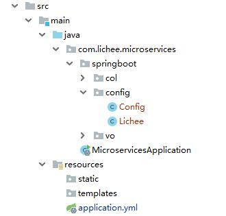

# Spring Boot 参数自动装配

## Spring Boot 自带配置项

Spring Boot 默认自带了很多配置项，可以根据自己的需要对 application.properties 或者 application.yml 进行修改，这里对几种常见的做一个演示。

默认配置项可以参考：[Spring Boot Docs](https://docs.spring.io/spring-boot/docs/2.1.5.RELEASE/reference/htmlsingle/)

```yaml
spring:
  application:
    name: lichee
  mandatory-file-encoding: UTF-8
  http:
    encoding:
      enabled: true
      charset: UTF-8
```

- name

  应用的名字。

- mandatory-file-encoding

  应用程序必须使用预期的字符编码。

- enabled

  启动 http 的编码支持。

- charset

  HTTP请求和响应的字符集。

## 自定义配置项

### 配置文件方式

Spring Boot 不但可以修改它自带的属性，也可以自定义需要的属性，只要 key 不重复就好。也是根据自己的需要对 application.properties 或者 application.yml 进行属性添加。

```yaml
config:
  lichee:
    name: 里奇
    age: 30
```

使用方式和以前传统的 Spring 模式一样，通过 **@Value** 注释来获取。

```java
@Value("${config.lichee.name}")
private String name;

@Value("${config.lichee.age}")
private int age;
```

### 配置类方式

Spring Boot 的配置类必须被 @Configuration 注释所标记，Spring 通过 package 扫描的机制就可以识别出这个类是配置类，就会通过配置的信息进行属性、对象等注入。

```java
@Configuration
public class Config {

    @Bean
    public Lichee initLichee() {

        return new Lichee();
    }
}
```

这个 initLichee 方法上面的 @Bean 注释是关键，只有标记了这个注释后，才能把  Lichee 这个实例交给 Spring 管理的 Bean 对象。也就是 initLichee 这个方法返回的对象是 Spring 管理的，Spring 才会进行属性、对象注入。

```java
public class Lichee {

    @Value("${config.lichee.name}")
    private String name;

    @Value("${config.lichee.age}")
    private int age;

    public String getName() {
        return name;
    }

    public void setName(String name) {
        this.name = name;
    }

    public int getAge() {
        return age;
    }

    public void setAge(int age) {
        this.age = age;
    }
}
```

上面的操作完成以后，就可以在需要的地方进行调用了。

```java
	@Autowired
    private Lichee lichee;
```

### 配置类方式最佳实践

在项目中，专门分配一个名为 config 的 package，把项目相关的 [Java Config](https://stackoverflow.com/questions/46486886/what-is-javaconfig-in-spring) 都放在这个 package 里。 



几年前 Java Config 这种做法是不对的，而现在提倡这样。

