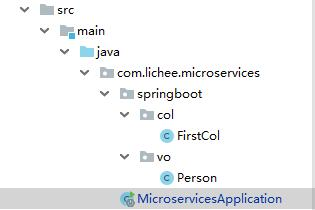

# 使用 Gradle 构建 Spring Boot 应用

## 关键插件配置

### Spring Boot Gradle Plugin

```groovy
plugins {
    id 'org.springframework.boot' version '2.1.4.RELEASE'
}
```

Spring Boot Gradle Plugin 为 Spring Boot 提供了对 Gradle 的支持，允许你将打包可执行的 jar 或者 war archives。

有了这个插件配置以后，就会有 bootRun、bootJar、bootWar 等额外的任务。

[注意：Spring Boot Gradle 插件需要 Gradle 4.4 或更高版本](https://docs.spring.io/spring-boot/docs/2.1.4.RELEASE/gradle-plugin//reference/html/)

### io.spring.dependency-management Plugin

```groovy
apply plugin: 'java'
apply plugin: 'io.spring.dependency-management'
```

当使用了 io.spring.dependency-management 依赖管理插件，Spring Boot 的插件会自动地从你使用的 Spring Boot 版本里导入 spring-boot-dependencies bom。允许你在声明依赖的时候忽略掉版本号，使用这项功能，只需要正常的声明依赖，不用写版本号就可以了。

例如：

```groovy
dependencies {
   implementation 'org.springframework.boot:spring-boot-starter-web'
   testImplementation 'org.springframework.boot:spring-boot-starter-test'
}
```

## 主类

Spring Boot 应用都有 1 个被 @SpringBootApplication 注释所标识的 java 类，这个类一般被称为 Spring Boot 应用的主类。

### 最佳实践

Spring Boot 应用主类所放置的位置，一般是在 package 的最顶层。这是因为 @SpringBootApplication 注释的包扫描机制所决定的，扫描机制：扫描当前 package，以及当前 package 下的所有子 package ，来进行自动装配和类型加载。而且这个主类所在的 package 里最好不要放置其他任何文件，只放置这个主类。

如下图：



