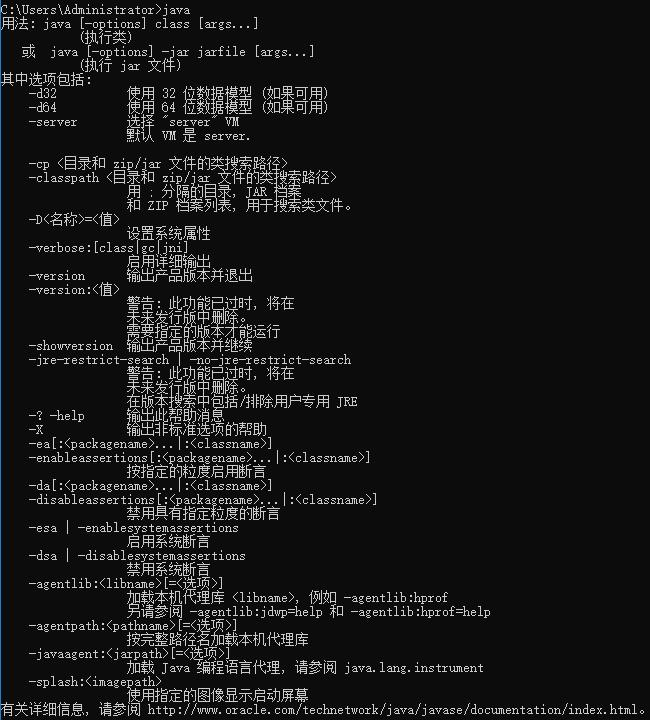
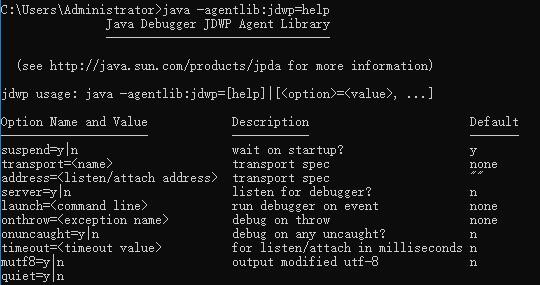
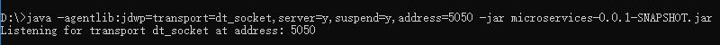
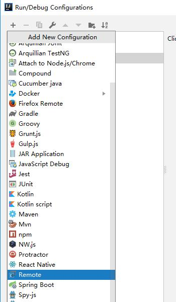
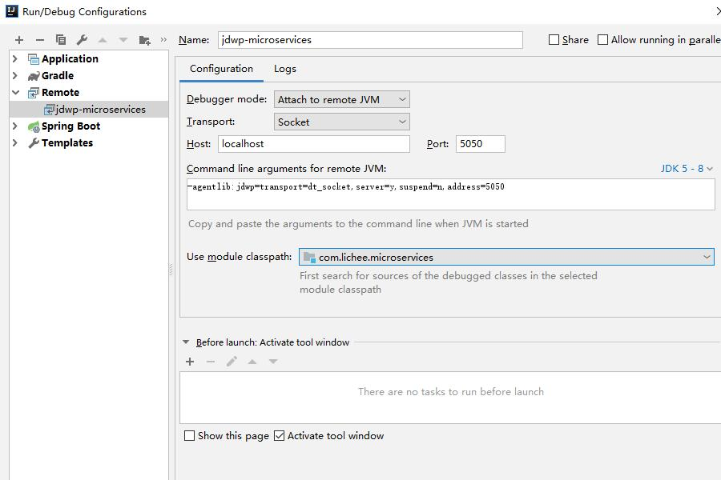
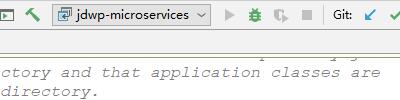
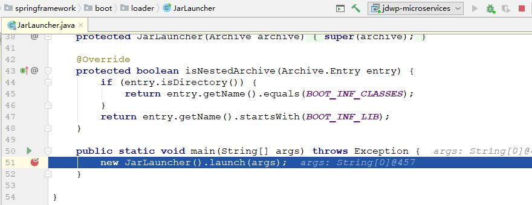

# JDWP 远程调试

##  背景

在日常开发中，大家借助 IDE 都会经历调试程序的情况，除 IDE 以外，其实 Java 还提供了一种调试程序的协议，JDWP。

典型的场景，代码在本机运行正常，发布到服务器后，就出现了各种问题。这个时候如果想定位问题位置，就变得不是那么简单了。一种是打日志，就需要把相关的日志都打印出来，还牵扯到重新部署等等问题，会非常麻烦。另外一种比较好的方式是远程调试，程序还是在服务器，把服务器的程序与本机源代码做关联，在本机可以根据断点单步调试来定位问题。

## 定义

Java Debug Wire Protocol， Java 调试协议。

无论以 main 方法运行，还是以 jar 包运行，都可以远程调试。本质来说，是通过 socket 和端口号把服务器和客户端连接。连接建立成功以后，就可以通过断点定位到需要调试的程序。

## 观察

打开命令行，输入 `java` 命令。



再次输入 agentlib 指令。

`java -agentlib:jdwp=help`

主要是前 4 个选项。



### suspend

是否在启动的时候就等待，表示程序一启动就停下，等待远程调试 socket 和它建立连接。

### transport

传输规范，用 JDWP 调试程序一般叫做：**dt_socket**。

### address

地址，表示的是需要调试的地址。

### server

是否监听调试器，需要改成 y，要监听调试器。

### launch

当事件发生时运行调试器（用不到）。

### onthrow

抛出异常时（用不到）。

### onuncaught

没有捕获异常时（用不到）。

### timeout

监听超时时间。（用不到）。

### mutf8

（用不到）。

### quiet

（用不到）。

## 使用

使用 JDWP 协议进行远程调试的时候，有两个 socket，一个是服务器，另一个是客户端。服务器优先启动，然后等待客户端来连接，客户端也称为调试器（debugger）。

### 关联源代码

首先把想要调试的源代码和 IDE 进行关联，并在 IDE 内打好断点。

题外话：直接在 idea 里面关联了 spring-boot-loader.jar 源码后，打好断点。右键 debug 来调试是无法进入 spring-boot-loader.jar 源码的，原因还是因为类加载器的问题。右键使用的是系统类加载器，并没有使用到 Spring Boot 提供的类加载器。

### 启动服务端 socket

监听调试器，启动好服务器端的 socket。

```java
java -agentlib:jdwp=transport=dt_socket,server=y,suspend=y,address=5050 -jar microservices-0.0.1-SNAPSHOT.jar
```

这里的 address 不用写 ip 地址，只需要些端口号就可以了。因为这里是启动服务器，只有客户端来连接服务器的时候，才需要指定服务器的 ip ，而服务器启动只需要指定端口就可以了。



当出现 Listening for transport ... 的时候就说明服务端的 socket 已经启动成功了，在本地 5050 这个端口号上等待客户端 socket 的连接。

### 启动客户端 socket

首先在 Idea 的 Run/Debug 里面找到 Remote 选项。



随便取一个名字。



Debugger mode 选择 Attach to remote JVM，表示附加到远程的 JVM 上。Transport 选择 Socket 方式，Host 为本机，Port 修改为 5050，module 选择我们自己的模块。

会发现下面出现了命令行指令
```java
-agentlib:jdwp=transport=dt_socket,server=y,suspend=n,address=5050
```

address 没有 ip 的原因是调试本机 localhost 可以省略，连接远程的话就必须把 ip 写全。比对没什么错误后，点击 OK，就可以在 Idea 里面直接运行了，点击 debug 小虫虫。



神奇般的进入了之前在 JarLauncher 里面打的断点。



现在就可以用调试的方式，来逐步阅读 spring-boot-loader.jar 源码了，对于特别复杂的框架源码来说，实时的查看每一步执行的结果，这样的效率提升大大降低了阅读源码的困难性。

## 注意

以上是基于 jar 运行方式的远程调试，如果目标应用是 web 应用，那么需要针对 tomcat 做一些 JDWP 的配置，就可以远程调试 web 应用了。**一旦客户端断开了调试，那么服务器也需要重新启动 socket。**

