# 使用 JDWP 调试 Spring Boot Loader 源码

## 准备工作

按照之前 [JDWP 远程调试](JDWP.md) 的内容，搭建好一个调试环境。

## new JarLauncher

```java
new JarLauncher();
```

在启动的第一步，子类 JarLauncher 构造器虽然没做什么，但是父类 ExecutableArchiveLauncher 在构造器中会调用 createArchive 方法来构造一个 Archive。其实这个 Archive 返回的就是被执行 jar 的绝对路径，并包装成一个 JarFileArchive。

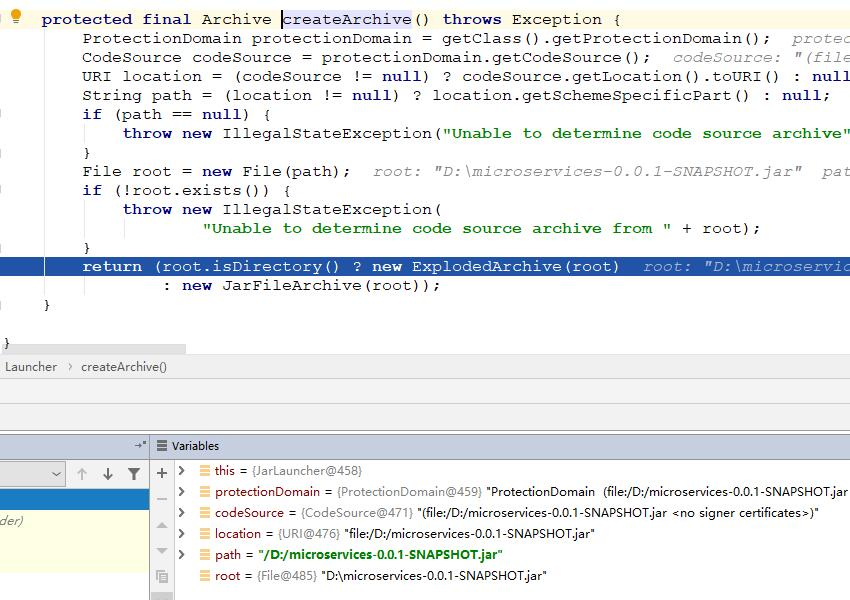

观察 archive 的值，会发现就是 jar 在本地的绝对路径，**前面的 jar:file:/ 和后面的 !/ 都是 jar 规范。**

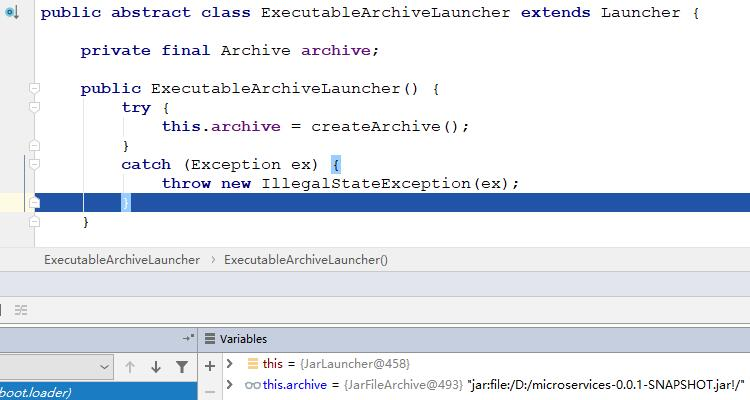

## launch(args)

```java
/**
 * Launch the application. This method is the initial entry point that should be
 * called by a subclass {@code public static void main(String[] args)} method.
 * @param args the incoming arguments
 * @throws Exception if the application fails to launch
 */
protected void launch(String[] args) throws Exception {
   JarFile.registerUrlProtocolHandler();
   ClassLoader classLoader = createClassLoader(getClassPathArchives());
   launch(args, getMainClass(), classLoader);
}
```

### registerUrlProtocolHandler

注册 url 协议处理器，不是特别重要。

### createClassLoader

创建自定义加载器，相当重要。

#### getClassPathArchives

获取 jar 路径的归档文件集合。

```java
@Override
protected List<Archive> getClassPathArchives() throws Exception {
   List<Archive> archives = new ArrayList<>(
         this.archive.getNestedArchives(this::isNestedArchive));
   postProcessClassPathArchives(archives);
   return archives;
}
```

返回了一个 List<Archive> 集合，这里面装的是什么呢？先看结果，再分析。

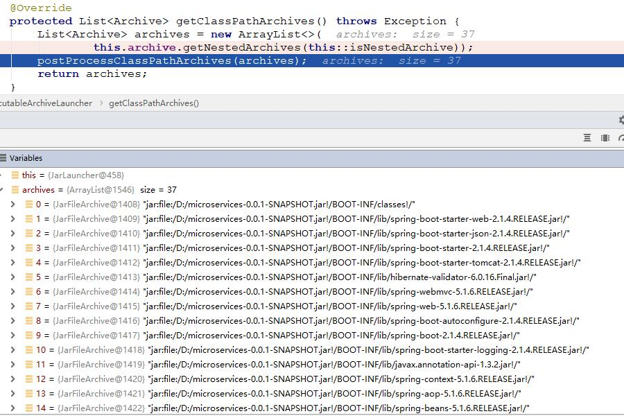

返回的 archives 包含的就是 BOOT-INF/classes 这个目录 和 BOOT-INF/lib 下的所有三方 jar 包，也就是我们应用程序编译生成的 class 文件以及所依赖的三方库。

#### isNestedArchive

```java
@Override
protected boolean isNestedArchive(Archive.Entry entry) {
   if (entry.isDirectory()) {
      return entry.getName().equals(BOOT_INF_CLASSES);
   }
   return entry.getName().startsWith(BOOT_INF_LIB);
}
```

它会判断当前 classes 目录或者 三方依赖 jar 文件，是不是位于 BOOT-INF 下。起判断作用。

#### getNestedArchives

```java
@Override
public List<Archive> getNestedArchives(EntryFilter filter) throws IOException {
   List<Archive> nestedArchives = new ArrayList<>();
   for (Entry entry : this) {
      if (filter.matches(entry)) {
         nestedArchives.add(getNestedArchive(entry));
      }
   }
   return Collections.unmodifiableList(nestedArchives);
}
```

根据 isNestedArchive 方法提供的判断，来构建 List<Archive>。**这里的 for 循环，是把整个被执行 jar 文件的每一个文件和目录都循环一次，当满足 isNestedArchive 要求（目录等于 BOOT_INF_CLASSES 或者文件等于 BOOT_INF_LIB 下的每一个三方依赖 jar）的 entry 都会被加入到集合当中，并且返回。**

#### createClassLoader

```java
/**
 * Create a classloader for the specified archives.
 * @param archives the archives
 * @return the classloader
 * @throws Exception if the classloader cannot be created
 */
protected ClassLoader createClassLoader(List<Archive> archives) throws Exception {
   List<URL> urls = new ArrayList<>(archives.size());
   for (Archive archive : archives) {
      urls.add(archive.getUrl());
   }
   return createClassLoader(urls.toArray(new URL[0]));
}
```

进行一次 for 循环，把 List<Archive> 转换成 List<URL>，再观察 List<URL> 的值，**这里转换成 List<URL> 的原因是，Spring Boot 自定义的类加载器 LaunchedURLClassLoader，其实也是继承 URLClassLoader，最终通过 URL 来进行类加载器的加载。**

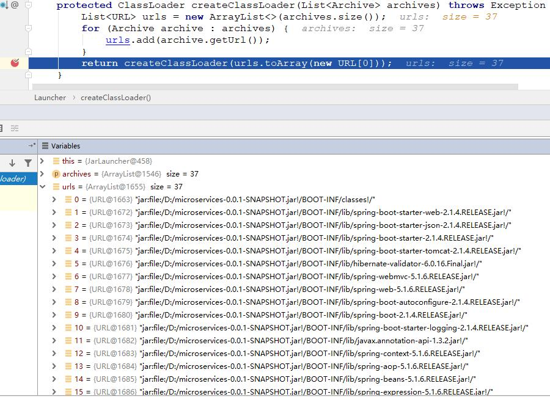

继续跟踪。

```java
/**
 * Create a classloader for the specified URLs.
 * @param urls the URLs
 * @return the classloader
 * @throws Exception if the classloader cannot be created
 */
protected ClassLoader createClassLoader(URL[] urls) throws Exception {
   return new LaunchedURLClassLoader(urls, getClass().getClassLoader());
}
```

到了这里，就发现了 LaunchedURLClassLoader，Spring Boot 自定义的全新类加载器。**这里面的 getClass().getClassLoader() 这个参数非常重要，当我们要创建一个新的类加载器的时候，一定要指定当前被创建类加载器它的父加载器。**

#### LaunchedURLClassLoader

类加载器的构造方法，**我们观察一下它的父加载器是什么？其实就是 Launcher$AppClassLoader。**

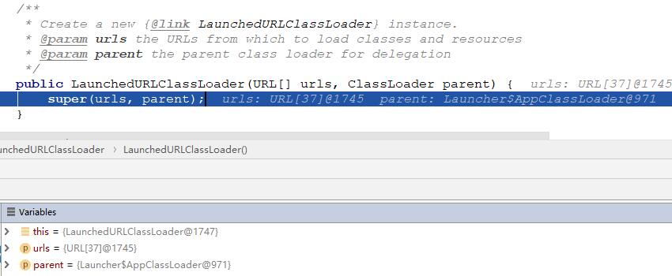

**这个父加载器的参数是从 Launcher 类传递过来的，所以名字叫做 Launcher$AppClassLoader，这也说明了，其实 Launcher 这个类是由 AppClassLoader 系统类加载器加载的。**

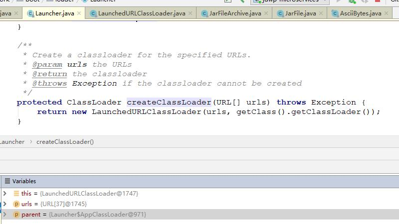

上面的过程，也解释了为什么 Spring Boot 要把 spring-boot-loader.jar 整个 jar 包直接解压到 Spring Boot 应用 jar 包的最顶层，而不是采用传递依赖方式。通过这种方式，由系统类加载器来加载 Launcher 这些类，然后在由自定义的 LaunchedURLClassLoader 来加载 BOOT-INF 下面的工程文件和三方依赖 jar 文件。

**到了这一步，自定义的类加载器 LaunchedURLClassLoader 已经准备好了。**

### launch

#### getMainClass

通过这个方法来获得，在 MANIFEST.MF 文件中定义 Start-Class

```java
@Override
protected String getMainClass() throws Exception {
   Manifest manifest = this.archive.getManifest();
   String mainClass = null;
   if (manifest != null) {
      mainClass = manifest.getMainAttributes().getValue("Start-Class");
   }
   if (mainClass == null) {
      throw new IllegalStateException(
            "No 'Start-Class' manifest entry specified in " + this);
   }
   return mainClass;
}
```

观察实际值，就是在 MANIFEST.MF 文件中定义 Start-Class。

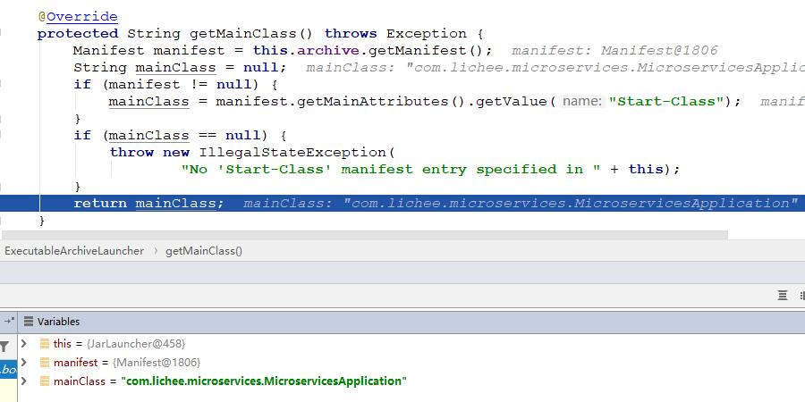

#### launch

```java
/**
 * Launch the application given the archive file and a fully configured classloader.
 * @param args the incoming arguments
 * @param mainClass the main class to run
 * @param classLoader the classloader
 * @throws Exception if the launch fails
 */
protected void launch(String[] args, String mainClass, ClassLoader classLoader)
      throws Exception {
   Thread.currentThread().setContextClassLoader(classLoader);
   createMainMethodRunner(mainClass, args, classLoader).run();
}
```

第一行代码把自定义的 classloader 设置到当前线程上下文类加载器，在默认情况下，当前线程上下文类加载器就是 AppClassLoader。通过这种方式就把当前线程上下文的默认类加载器换成了 Spring Boot 自定义的类加载器。

那么在调用 setContextClassLoader 之前，当前线程上下文类加载器是什么呢？

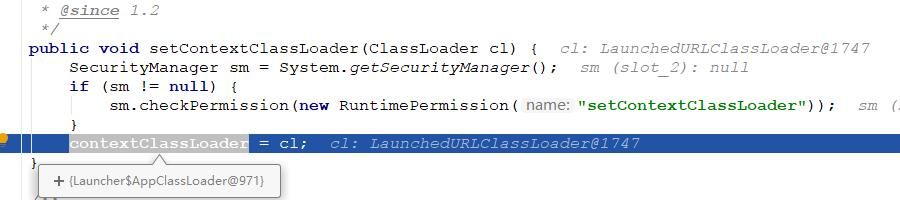

**是 Launcher$AppClassLoader 类加载器。如果不去设置前线程上下文类加载器，在默认情况下，当前线程上下文类加载器就是 AppClassLoader。**

#### createMainMethodRunner

创建 MainMethodRunner，用于启动和加载应用。

其实这里的 classLoader 并没有用到。

```java
/**
 * Create the {@code MainMethodRunner} used to launch the application.
 * @param mainClass the main class
 * @param args the incoming arguments
 * @param classLoader the classloader
 * @return the main method runner
 */
protected MainMethodRunner createMainMethodRunner(String mainClass, String[] args,
      ClassLoader classLoader) {
   return new MainMethodRunner(mainClass, args);
}
```

#### run

```java
public void run() throws Exception {
   Class<?> mainClass = Thread.currentThread().getContextClassLoader()
         .loadClass(this.mainClassName);
   Method mainMethod = mainClass.getDeclaredMethod("main", String[].class);
   mainMethod.invoke(null, new Object[] { this.args });
}
```

**Thread.currentThread().getContextClassLoader() 获取当前线程上下文类加载器，其实也就是获取我们之前已经设置好的 LaunchedURLClassLoader。**

可以观察 mainClass 是什么？就是我们应用的入口。

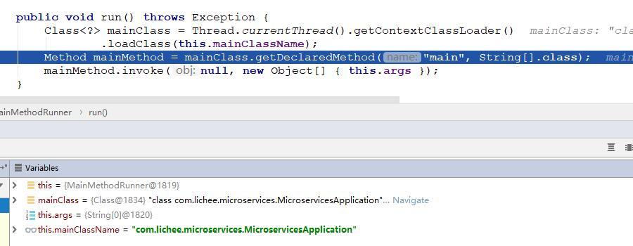

再观察反射获得的 method，invoke 调用这个方法。

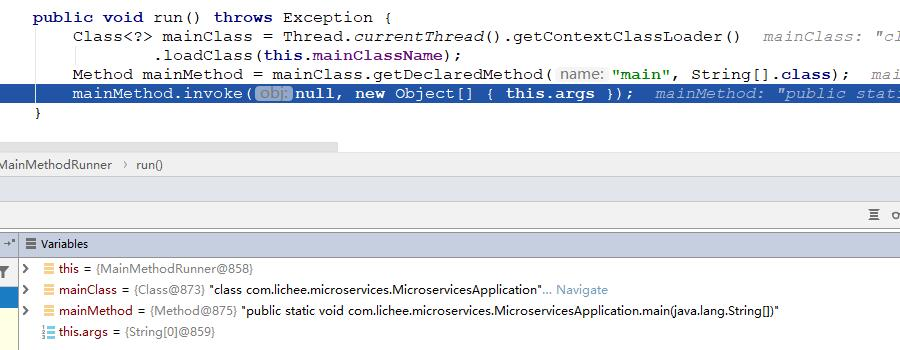

最后，开始启动了。

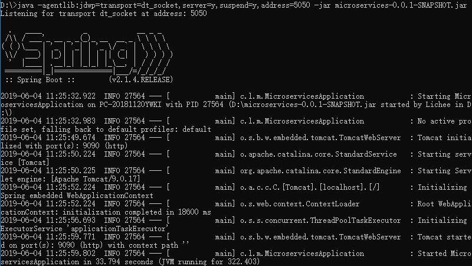

## 总结

Spring Boot Loader 采用非常精巧、整洁的设计，让应用能以不符合 jar 包规范的方式运行，也就是 FatJar。同时还能以传统的 `java -jar` 这种方式去启动执行，通过自定义类加载器的方式，非常优雅且合理的规避了很多 [Jar 文件规范](JarFileSpecification.md) 问题。

借助于 Spring Boot Loader，可以让应用能以 FatJar 形式打成 jar 包，并部署。