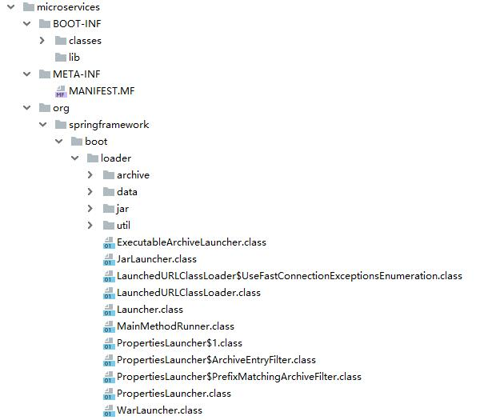
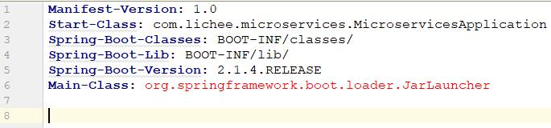
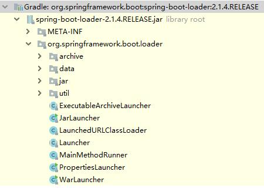
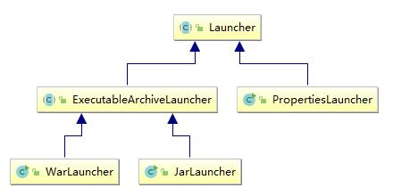

# Spring Boot Loader 源码分析

## Spring Boot jar

我们之间就发现 Spring Boot 打包出来的 jar 解压后，有三个目录。



### BOOT-INF

#### classes

当前工程编译好的结果文件，包含 src/main/java 和 src/main/resources 下的所有文件。

#### lib

当前工程依赖的所有 jar 文件（第三方 jar 包）。

### META-INF

只有一个文件：MANIFEST.MF。



### org

由 Spring Boot 提供的一堆字节码文件，入口类就在这里。

```java
org.springframework.boot.loader.JarLauncher
```

## org package 是怎么来的

BOOT-INF 是通过编译工程文件，META-INF 是打包时自动生成，那么 org package 是怎么来的？

```groovy
plugins {
   id 'org.springframework.boot' version '2.1.4.RELEASE'
   id 'java'
}
```

还记得我们之间配置的 gradle plugin 么？既然打包是由 org.springframework.boot 这个插件完成，那么答案肯定在这里。

根据 org 的目录结构，尝试增加一个依赖到工程里。

org.springframework.boot:spring-boot-loader （**在开发阶段，因为有 gradle 插件的存在，原则上这个依赖是不引入的，这里是研究需要**）

```groovy
dependencies {
   implementation 'org.springframework.boot:spring-boot-starter-web'
   implementation 'org.springframework.boot:spring-boot-loader'
   testImplementation 'org.springframework.boot:spring-boot-starter-test'
}
```

再观察 spring-boot-loader.jar，发现和上面的 org package 一模一样。



结论：说明 Spring Boot Gradle Plugin 在用 bootJar 任务对 Spring Boot 工程进行打包的时候，是把 spring-boot-loader.jar 这个 jar 解压，随后把解压内容放置在 Spring Boot 的应用 jar 里。而spring-boot-loader.jar 这个依赖，肯定是在 Spring Boot Gradle Plugin 里被依赖的。

疑问：为什么不直接把这个依赖传递给实际的 Spring Boot 应用，而是采用这么麻烦的方式，把这个依赖的**内容**打包进实际的 Spring Boot 应用。

## JarLauncher 启动类

根据 MANIFEST.MF 文件的描述。

Spring Boot 的启动类就是 

```java
Main-Class: org.springframework.boot.loader.JarLauncher
```

而 Spring Boot 的应用主类是

```java
Start-Class: com.lichee.microservices.MicroservicesApplication
```

### 源码

```java
package org.springframework.boot.loader;

import org.springframework.boot.loader.archive.Archive;

/**
 * {@link Launcher} for JAR based archives. This launcher assumes that dependency jars are
 * included inside a {@code /BOOT-INF/lib} directory and that application classes are
 * included inside a {@code /BOOT-INF/classes} directory.
 *
 * @author Phillip Webb
 * @author Andy Wilkinson
 */
public class JarLauncher extends ExecutableArchiveLauncher {

   static final String BOOT_INF_CLASSES = "BOOT-INF/classes/";

   static final String BOOT_INF_LIB = "BOOT-INF/lib/";

   public JarLauncher() {
   }

   protected JarLauncher(Archive archive) {
      super(archive);
   }

   @Override
   protected boolean isNestedArchive(Archive.Entry entry) {
      if (entry.isDirectory()) {
         return entry.getName().equals(BOOT_INF_CLASSES);
      }
      return entry.getName().startsWith(BOOT_INF_LIB);
   }

   public static void main(String[] args) throws Exception {
      new JarLauncher().launch(args);
   }

}
```

### 类关系图



从图中可以看出来，最顶层的启动器是 Launcher，其次是 ExecutableArchiveLauncher。最终的实现分别两种模式，一个是 JarLauncher（针对于 jar 归档文件），另一个是 WarLauncher（针对于 war 归档文件）。从这里也就说明了为什么 Spring Boot 的应用可以通过 jar 和 war 两种方式运行。

## 源码分析

通过代码可以发现，实际程序的入口是在：

```java
new JarLauncher().launch(args);
```

实际调用的 launch 方法是 Launcher.java 里的 launch 方法。

```java
/**
 * Launch the application. This method is the initial entry point that should be
 * called by a subclass {@code public static void main(String[] args)} method.
 * @param args the incoming arguments
 * @throws Exception if the application fails to launch
 */
protected void launch(String[] args) throws Exception {
   JarFile.registerUrlProtocolHandler();
   ClassLoader classLoader = createClassLoader(getClassPathArchives());
   launch(args, getMainClass(), classLoader);
}
```

这里一共 3 个步骤，最重要的就是第 2 步 ClassLoader  类加载器。

### registerUrlProtocolHandler

注册URL协议处理器，这个不重要，可以忽略。

```java
JarFile.registerUrlProtocolHandler();
```

### classLoader

最重要的就是自定义类加载器这个阶段。

```java
ClassLoader classLoader = createClassLoader(getClassPathArchives());
```

#### getClassPathArchives

返回所有符合条件的 jar 或 工程文件，并包装成一个类型为 Archive 的 List 对象。这里的符合条件是指在 BOOT-INF/lib/ 下的 jar 文件，和在 BOOT-INF/classes/ 下的所有工程文件，用来构建 classpath。

```java
@Override
protected List<Archive> getClassPathArchives() throws Exception {
   List<Archive> archives = new ArrayList<>(
         this.archive.getNestedArchives(this::isNestedArchive));
   postProcessClassPathArchives(archives);
   return archives;
}
```

#### createArchive

定位当前执行的具体 jar 文件或者文件目录，通过磁盘上的绝对路径来定位，返回一个 Archive 对象。

```java
protected final Archive createArchive() throws Exception {
   ProtectionDomain protectionDomain = getClass().getProtectionDomain();
   CodeSource codeSource = protectionDomain.getCodeSource();
   URI location = (codeSource != null) ? codeSource.getLocation().toURI() : null;
   String path = (location != null) ? location.getSchemeSpecificPart() : null;
   if (path == null) {
      throw new IllegalStateException("Unable to determine code source archive");
   }
   File root = new File(path);
   if (!root.exists()) {
      throw new IllegalStateException(
            "Unable to determine code source archive from " + root);
   }
   return (root.isDirectory() ? new ExplodedArchive(root)
         : new JarFileArchive(root));
}
```

#### getNestedArchives

返回与指定过滤器（EntryFilter）所匹配的嵌套归档文件。

```java
@Override
public List<Archive> getNestedArchives(EntryFilter filter) throws IOException {
    List<Archive> nestedArchives = new ArrayList<>();
    for (Entry entry : this) {
        if (filter.matches(entry)) {
            nestedArchives.add(getNestedArchive(entry));
        }
    }
    return Collections.unmodifiableList(nestedArchives);
}
```

#### isNestedArchive

EntryFilter 过滤器，判断 entry 所指定的文件（具体 jar 文件或者文件目录）是否满足条件 ，满足条件的应该添加到 classpath 里，每个指定的文件都会调用一次。

条件：在 BOOT-INF/classes/ 下的工程文件或者在 BOOT-INF/lib/ 下的第三方 jar 包。

**注意：其实这里就是在判断，要执行的 jar 文件是否是按照 Spring Boot 特有的目录结构来放置工程文件，以及所依赖的第三方 jar 包。只有满足条件的工程文件或所依赖的第三方 jar 包才会进入下一步，也就是通过自定义类加载器来加载这些满足条件的文件，这里就需要 jar 文件规范相关知识。**

```java
static final String BOOT_INF_CLASSES = "BOOT-INF/classes/";
static final String BOOT_INF_LIB = "BOOT-INF/lib/";

@Override
protected boolean isNestedArchive(Archive.Entry entry) {
    if (entry.isDirectory()) {
        return entry.getName().equals(BOOT_INF_CLASSES);
    }
    return entry.getName().startsWith(BOOT_INF_LIB);
}
```

#### postProcessClassPathArchives

是一个空方法，事后处理方法，回调方法。

```java
/**
 * Called to post-process archive entries before they are used. Implementations can
 * add and remove entries.
 * @param archives the archives
 * @throws Exception if the post processing fails
 */
protected void postProcessClassPathArchives(List<Archive> archives) throws Exception {
}
```

#### createClassLoader

上面的所有方法，都是为了准备 List<Archive> 对象，**所有符合条件的 jar（BOOT-INF/lib/ ）和工程文件（BOOT-INF/classes/ ），并包装成一个类型为 Archive 的 List 对象。**

创建一个针对指定归档文件（Archive）的自定义类加载器，也就是用来加载 getClassPathArchives 所返回的集合（jar 或者 工程文件），应用类加载器（也可以叫做系统类加载器）是加载不了这些文件的，就必须自己创建一个新的类加载器，用来加载这些存在于自定义目录内的文件。

这个方法是把传入的 List<Archive> 对象转撑一个 List<URL> 对象，URL 表示文件在磁盘上的绝对路径。

```java
**
 * Create a classloader for the specified archives.
 * @param archives the archives
 * @return the classloader
 * @throws Exception if the classloader cannot be created
 */
protected ClassLoader createClassLoader(List<Archive> archives) throws Exception {
   List<URL> urls = new ArrayList<>(archives.size());
   for (Archive archive : archives) {
      urls.add(archive.getUrl());
   }
   return createClassLoader(urls.toArray(new URL[0]));
}
```

#### LaunchedURLClassLoader

Spring Boot 提供的自定义类加载器，urls 表示所有需要加载文件的 url（jar 文件的绝对路径），getClass().getClassLoader() 表示父加载器（也就是应用类加载器）。

**注意：在创建一个类加载器的时候，一定要指定它的父加载器 getClass().getClassLoader(），这这个父加载器其实就是应用类加载器。**

这个方法创建一个针对指定归档文件（URL）的类加载器。

```java
/**
 * Create a classloader for the specified URLs.
 * @param urls the URLs
 * @return the classloader
 * @throws Exception if the classloader cannot be created
 */
protected ClassLoader createClassLoader(URL[] urls) throws Exception {
   return new LaunchedURLClassLoader(urls, getClass().getClassLoader());
}
```

### launch

最后阶段，通过反射来完成工程应用启动。

```java
launch(args, getMainClass(), classLoader);
```

#### getMainClass

返回应该被加载的主类。从 Manifest 对象种，获取 Start-Class 属性，这个 Start-Class 是什么呢？

MANIFEST.MF 文件中定义 Start-Class: com.lichee.microservices.MicroservicesApplication

```java
@Override
protected String getMainClass() throws Exception {
   Manifest manifest = this.archive.getManifest();
   String mainClass = null;
   if (manifest != null) {
      mainClass = manifest.getMainAttributes().getValue("Start-Class");
   }
   if (mainClass == null) {
      throw new IllegalStateException(
            "No 'Start-Class' manifest entry specified in " + this);
   }
   return mainClass;
}
```

#### launch

通过给定的归档文件和全新的 classloader 来启动应用。

```java
/**
 * Launch the application given the archive file and a fully configured classloader.
 * @param args the incoming arguments
 * @param mainClass the main class to run
 * @param classLoader the classloader
 * @throws Exception if the launch fails
 */
protected void launch(String[] args, String mainClass, ClassLoader classLoader)
      throws Exception {
   Thread.currentThread().setContextClassLoader(classLoader);
   createMainMethodRunner(mainClass, args, classLoader).run();
}
```

第一行代码把自定义的 classloader 设置到当前线程上下文类加载器，在默认情况下，当前线程上下文类加载器就是 AppClassLoader。通过这种方式就把当前线程上下文的默认类加载器换成了 Spring Boot 自定义的类加载器。

**转换：AppClassLoader  -->   LaunchedURLClassLoader**

**现在是把类加载器放置进去，在未来某处肯定会从当前线程中取出这个上下文类加载器，然后进行类加载。**

#### createMainMethodRunner

创建 MainMethodRunner，用于启动和加载应用。

其实这里的 classLoader 并没有用到。

```java
/**
 * Create the {@code MainMethodRunner} used to launch the application.
 * @param mainClass the main class
 * @param args the incoming arguments
 * @param classLoader the classloader
 * @return the main method runner
 */
protected MainMethodRunner createMainMethodRunner(String mainClass, String[] args,
      ClassLoader classLoader) {
   return new MainMethodRunner(mainClass, args);
}
```

#### MainMethodRunner

使用当前线程上下文类加载器，加载一个包含了 main 方法的主类，然后调用这个主类的 main 方法。主要看这个 run 方法。

```java
/**
 * Utility class that is used by {@link Launcher}s to call a main method. The class
 * containing the main method is loaded using the thread context class loader.
 *
 * @author Phillip Webb
 * @author Andy Wilkinson
 */
public class MainMethodRunner {

   private final String mainClassName;

   private final String[] args;

   /**
    * Create a new {@link MainMethodRunner} instance.
    * @param mainClass the main class
    * @param args incoming arguments
    */
   public MainMethodRunner(String mainClass, String[] args) {
      this.mainClassName = mainClass;
      this.args = (args != null) ? args.clone() : null;
   }

   public void run() throws Exception {
      Class<?> mainClass = Thread.currentThread().getContextClassLoader()
            .loadClass(this.mainClassName);
      Method mainMethod = mainClass.getDeclaredMethod("main", String[].class);
      mainMethod.invoke(null, new Object[] { this.args });
   }

}
```

#### run

当我们使用下面这个指令的时候，就会启动 Spring Boot 的应用，原理就在这个 run 方法。

```java
java -jar microservices-0.0.1-SNAPSHOT.jar
```

Thread.currentThread().getContextClassLoader() 获取当前线程上下文类加载器，其实也就是获取我们之前已经设置好的 LaunchedURLClassLoader。之前从 MANIFEST.MF 文件中把 Start-Class 取出来，也就是我们的主类：com.lichee.microservices.MicroservicesApplication，通过 loadClass 方法就把主类加载到虚拟机中，于是得到主类的一个 Class 对象。

通过反射主类 Class 对象的方式，拿到主类的 main 方法。

```java
Method mainMethod = mainClass.getDeclaredMethod("main", String[].class);
```

通过反射方式直接调用 main 方法。

```java
mainMethod.invoke(null, new Object[] { this.args });
```

总结下来三个步骤：

1. 通过当前线程上下文类加载器加载 Start-Class 定义的主类到虚拟机中，拿到 Class 对象
2. 通过 Class 对象反射拿到 main 方法
3. 通过反射执行 main 方法

## 思考

**为什么 Spring Boot 规定入口类（被 @SpringBootApplication 注释的类）的启动方法是 main 方法？**

通过上面的源码分析，不需要非要 main 方法才可以，在反射阶段，完全可以换成另外一个普通的实例方法，只要在反射的时候，更换方法名就可以。

```java
Method mainMethod = mainClass.getDeclaredMethod("main", String[].class);
```

**原因在于为了方便 Spring Boot 应用开发阶段的运行、调试。**

### 两种运行方式

Spring Boot 可以通过以下两种方式运行，好处就是便利了日常开发、调试、测试阶段。

#### jar 

通过指令运行。

```java
java -jar microservices-0.0.1-SNAPSHOT.jar
```

#### main

直接在开发阶段的 ide（eclipse、idea）里右键 run 方式运行。

## 总结

### 打包机制

Spring Boot 打包机制，通过 gradle plugin 的 org.springframework.boot 插件对应用打成 jar 包，在 jar 包的根目录放置 spring-boot-loader.jar 这个 jar 包解压缩后的所有文件。自定义 BOOT-INF 和 META-INF 两个目录，BOOT-INF/classes 放置工程文件，BOOT-INF/lib 放置工程三方依赖，MANIFEST.MF 文件中定义 Start-Class 和 Main-Class 属性。

### 运行机制

Spring Boot 运行机制，首先应用加载器（系统加载器）加载 org.springframework.boot.loader.JarLauncher。在加载 JarLauncher 的同时，创建一个 Spring Boot 特有的类加载器 LaunchedURLClassLoader，用这个特有的类加载器加载 BOOT-INF 下的工程文件和三方依赖。最后通过反射调用 Start-Class 应用入口类的 main 方法启动应用程序。