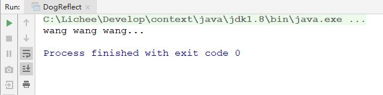

# 反射扩展

Spring Boot Loader 源码分析中，有这么一行代码，通过反射调用 main 方法。

```java
mainMethod.invoke(null, new Object[] { null });
```

## invoke

invoke 方法一般会接收 2 个参数，第 1 个是被调用方法所在类的对象，第 2 个参数被调用方法所接收的参数。

而 Spring Boot 这里为什么第 1 个参数传递的是 null ？

## 源码

```java
@SpringBootApplication
public class MicroservicesApplication {

    public static void main(String[] args) {

        SpringApplication.run(MicroservicesApplication.class, args);
    }

}
```

## 原因

这里反射调用的是 main 方法，main 方法是静态方法。原则上，静态方法是不归属于它所在的具体类，它只是把静态方法寄存在它所在的具体类。java 中所有的方法，都需要依托一个具体的类才能存在。寄存在这个类，其实也就相当于依托这个类。

静态方法不归属于它所在的类，而是归属于当前所在类对应的 class 对象。

所以这里是可以传 null，也可以传递具体的对象。

## 实践

先定义 Dog。

```java
public class Dog {

    public static void main(String[] args) {

        System.out.println("wang wang wang...");
    }
}
```

再定义 DogReflect，通过反射调用 Dog 的 main 方法。

```java
public class DogReflect {

    public static void main(String[] args) throws NoSuchMethodException, InvocationTargetException, IllegalAccessException {

        Class<?> mainClass = Dog.class;
        Method mainMethod = mainClass.getDeclaredMethod("main", String[].class);
        mainMethod.invoke(null, new Object[] { null });
    }
}
```

正常执行，说明调用是没问题的。



通过一个实例来调用，而不用null，结果也是正确的。

```java
mainMethod.invoke(new Dog(), new Object[] { null });
```